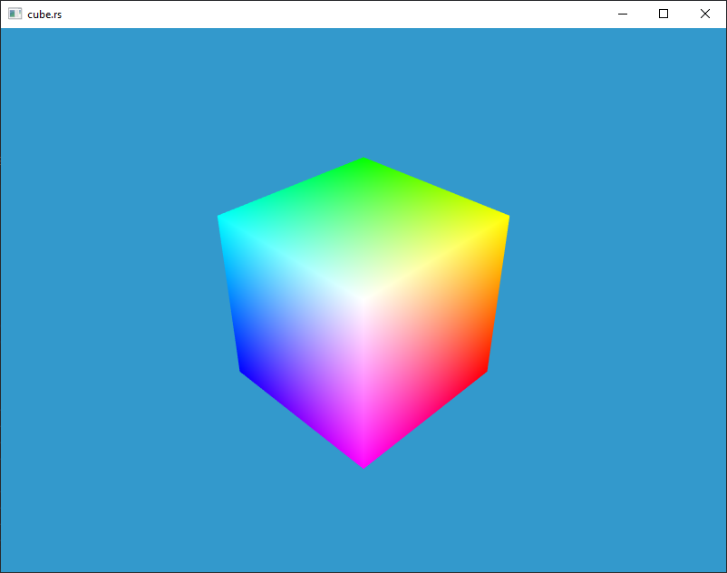

# Examples

The triangle examples demonstrate initialization and basic event
handling, where as the remaining examples use a common framework to
manage these tasks. The examples framework has the following camera
controls:

### Camera Controls

|Key|Movement| 
|---|---| 
|`W`, `S`, `A`, `D`|Forward, Backward, Strafe-Left, Strafe-Right|
|`PageUp`, `PageDown`|Up, Down|
|`C`|Set the camera's focus point at the origin|
|`Mouse-Click-Drag`|Rotate the camera around the focus point|
|`Mouse-Scroll`|Move the camera toward or away from the focus point|

## triangle.rs

## triangle_multisample.rs

## cube.rs

## cube_texture.rs

